# SOP-005 — Release and Deployment

**Effective:** 2026-03-11
**Owner:** Daniel Shanklin
**Applies to:** All Greenmark Waste Solutions services deployed via Railway, Supabase, and GitHub Actions

---

## BLUF

Every production change follows the same pipeline: **branch → test → review → merge → auto-deploy → verify → monitor.** Database migrations always deploy to the test project first. Rollbacks are service-specific — know your service's rollback path before you deploy. This SOP is the single source of truth for how code moves from a developer's machine to production.

---

## 1. Release Pipeline Overview

All Greenmark services follow a trunk-based deployment model. Code merges to a target branch (`main` or `develop`) trigger GitHub Actions, which deploy to Railway via the Railway CLI. Database migrations follow a separate, more cautious path through the Supabase test project before touching production.

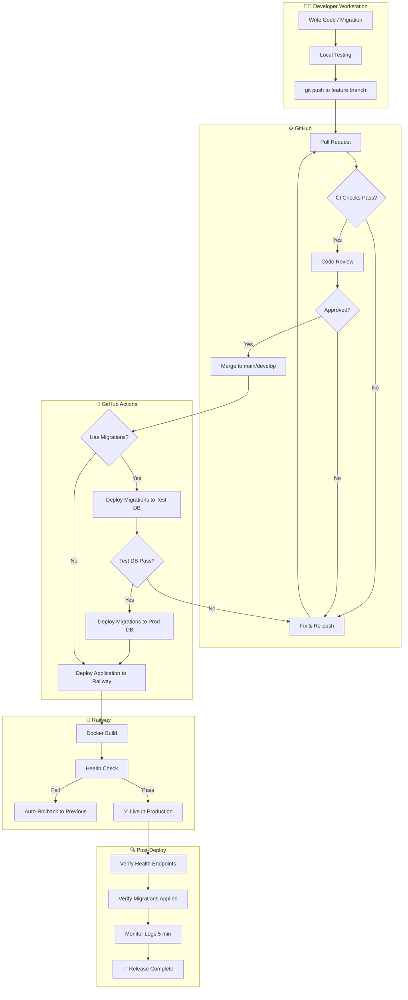

---

## 2. Service Inventory

Greenmark operates five services, all deployed to Railway. Each has its own repository, deployment trigger, and health check.

### 2.1 Service Matrix

| Service | Repo | Language | Deploy Branch | Health Endpoint | Railway Env |
|---------|------|----------|---------------|-----------------|-------------|
| **Cerebro** | `greenmark-waste-solutions/cerebro` | Next.js / TypeScript | `main` (prod), `develop` (dev) | `/api/health` | production, develop |
| **Cerebro Migrations** | `greenmark-waste-solutions/cerebro-migrations` | SQL (Supabase CLI) | `main` | — (manual `npm run migrate`) | — |
| **Data Daemon** | `greenmark-waste-solutions/data-daemon` | Python 3.11 | `develop` | `/health` | develop |
| **AI Services** | `greenmark-waste-solutions/cerebro-ai-services` | Python 3.12 / FastAPI | `main` | `/ready` | production |
| **Bot Farm** | `greenmark-waste-solutions/cerebro-bot-farm` | Python 3.12 | `main` | (health check) | production |
| **Portal** | `greenmark-waste-solutions/portal` | Node.js / Express | manual | `/health` | — |

### 2.2 Service Dependency Graph

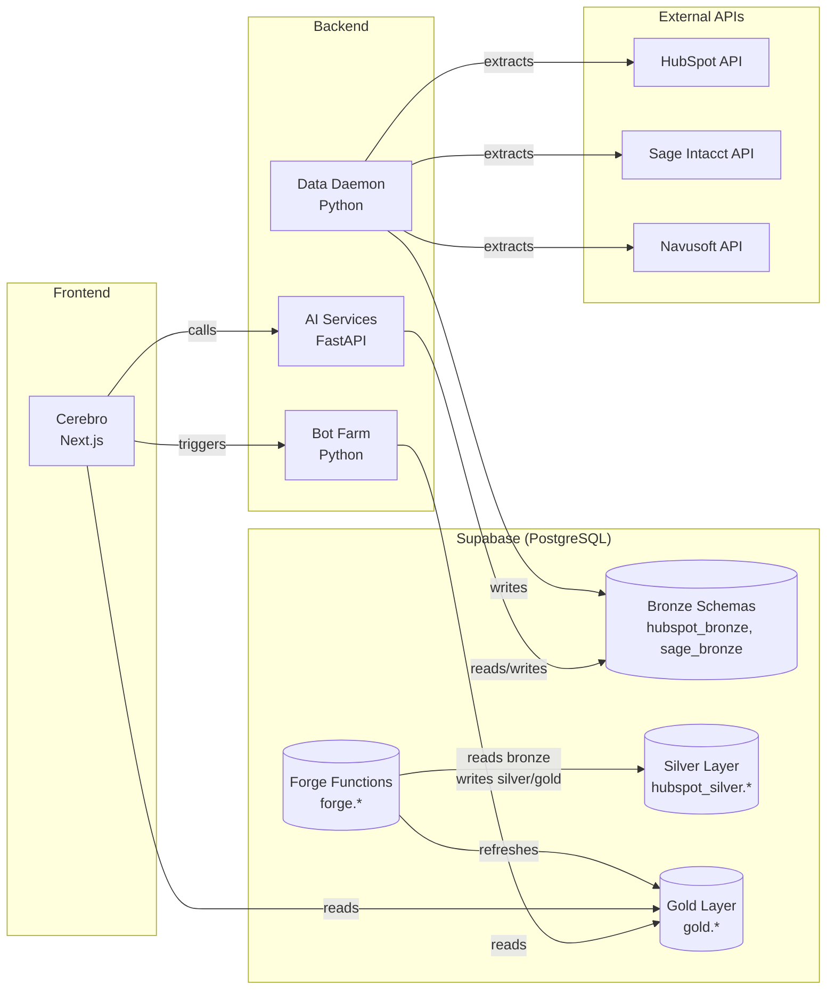

---

## 3. Tech Stack Reference

### 3.1 Infrastructure Components

| Component | Role | Configuration |
|-----------|------|---------------|
| **GitHub** | Source control, CI/CD via Actions | All repos under `greenmark-waste-solutions` org |
| **Railway** | Container hosting, zero-downtime deploys | Project: Greenmark Waste Solutions |
| **Supabase** | PostgreSQL database, auth, RLS | Prod: `wwmcgtyngnziepeynccz` / Test: `izmuckuepryqneebwwol` |
| **Docker** | Containerization for all services | Multi-stage Alpine builds |
| **Slack** | Deployment failure notifications | Channel: C0AD03NG53Q (bot-farm alerts) |

### 3.2 Build Tools

| Tool | Version | Used By |
|------|---------|---------|
| Node.js | 22 | Cerebro, Portal |
| Python | 3.11–3.12 | Data Daemon, AI Services, Bot Farm |
| TypeScript | (project version) | Cerebro |
| npm | (bundled with Node) | Cerebro, Portal |
| pip | (bundled with Python) | All Python services |
| Supabase CLI | latest | cerebro-migrations (ADR-2026-38) |
| Railway CLI | latest | All service deployments |

---

## 4. Pre-Flight Checklist

Before any merge to a deploy branch, verify every item on this checklist. AI agents and humans alike must follow this sequence.

### 4.1 Code Quality Gate

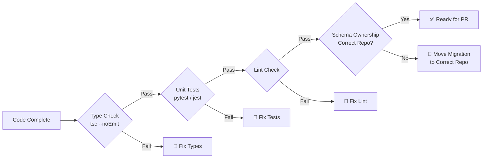

### 4.2 Pre-Flight Items

| # | Check | How | Required For |
|---|-------|-----|-------------|
| 1 | **Type check passes** | `npx tsc --noEmit` | Cerebro |
| 2 | **Unit tests pass** | `python -m pytest tests/ -v --ignore=tests/test_integration.py` | Data Daemon, Bot Farm |
| 3 | **E2E tests pass** | `python -m pytest tests/test_sales_e2e.py` | Bot Farm (main only) |
| 4 | **Schema ownership verified** | See SOP-002 ownership table | Any migration |
| 5 | **Migration tested on test DB** | `npx supabase db push --db-url <test-url>` | Cerebro migrations |
| 6 | **`IF NOT EXISTS` / `IF EXISTS` used** | Manual review | All migrations |
| 7 | **GRANT statements included** | For new tables/views | All migrations |
| 8 | **RLS policies included** | For new gold tables | Gold layer migrations |
| 9 | **SECURITY DEFINER used** | For forge refresh functions | Forge migrations |
| 10 | **No hard DELETEs** | `grep -r "DELETE FROM" <migration>` returns 0 | All migrations |
| 11 | **Governance check passed** | Run `check-governance` skillflow | All changes |
| 12 | **ADRs consulted** | Verify patterns match canonical ADRs | Schema changes |

---

## 5. Database Migration Deployment

Migrations are the highest-risk part of any deployment. They modify shared state that cannot be easily undone. Follow this procedure exactly.

### 5.1 Migration Systems

Per **ADR-2026-38**, all medallion schema DDL is owned by the dedicated `cerebro-migrations` repo. Neither cerebro nor data-daemon owns the database. Data-daemon retains only its daemon-internal migrations (daemon.* schema).

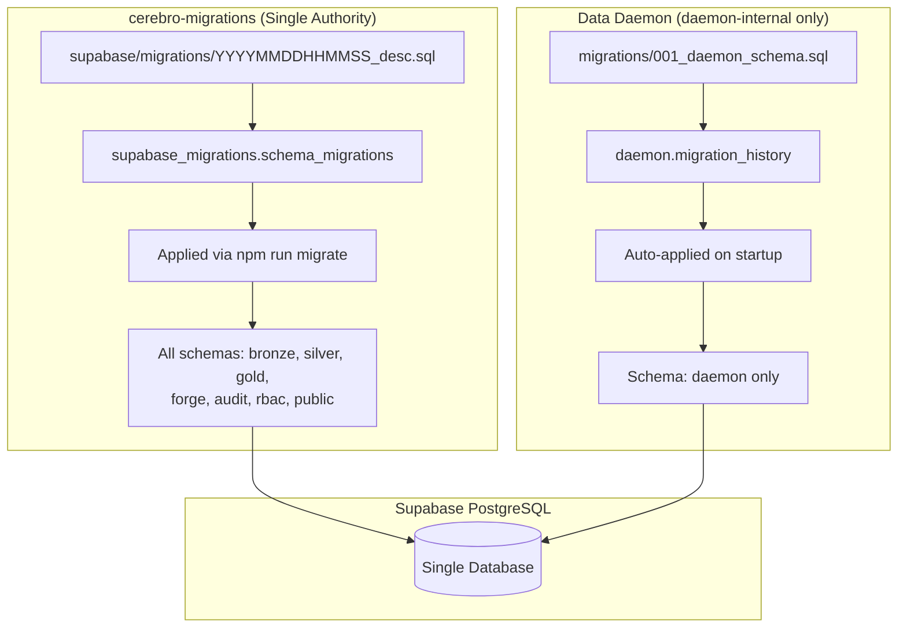

**Deploy sequence:** cerebro-migrations first (schema), then data-daemon and cerebro deploy whenever — both are forward-compatible. See ADR-2026-38 for the full rationale.

### 5.2 Schema Ownership Table

| Schema | Owner | Migration Format | Tracker Table |
|--------|-------|-----------------|---------------|
| `hubspot_bronze` | **cerebro-migrations** | `YYYYMMDDHHMMSS_desc.sql` | `supabase_migrations.schema_migrations` |
| `sage_bronze` | **cerebro-migrations** | `YYYYMMDDHHMMSS_desc.sql` | `supabase_migrations.schema_migrations` |
| `navusoft_bronze` | **cerebro-migrations** | `YYYYMMDDHHMMSS_desc.sql` | `supabase_migrations.schema_migrations` |
| `crm_bronze` | **cerebro-migrations** | `YYYYMMDDHHMMSS_desc.sql` | `supabase_migrations.schema_migrations` |
| `fleet_bronze` | **cerebro-migrations** | `YYYYMMDDHHMMSS_desc.sql` | `supabase_migrations.schema_migrations` |
| `hubspot_silver` | **cerebro-migrations** | `YYYYMMDDHHMMSS_desc.sql` | `supabase_migrations.schema_migrations` |
| `gold` | **cerebro-migrations** | `YYYYMMDDHHMMSS_desc.sql` | `supabase_migrations.schema_migrations` |
| `forge` | **cerebro-migrations** | `YYYYMMDDHHMMSS_desc.sql` | `supabase_migrations.schema_migrations` |
| `public` (auth) | **cerebro-migrations** | `YYYYMMDDHHMMSS_desc.sql` | `supabase_migrations.schema_migrations` |
| `rbac` | **cerebro-migrations** | `YYYYMMDDHHMMSS_desc.sql` | `supabase_migrations.schema_migrations` |
| `audit` | **cerebro-migrations** | `YYYYMMDDHHMMSS_desc.sql` | `supabase_migrations.schema_migrations` |
| `platform` | **cerebro-migrations** | `YYYYMMDDHHMMSS_desc.sql` | `supabase_migrations.schema_migrations` |
| `daemon` | Data Daemon | `NNN_desc.sql` | `daemon.migration_history` |

### 5.3 Migration Deployment Procedure (cerebro-migrations)

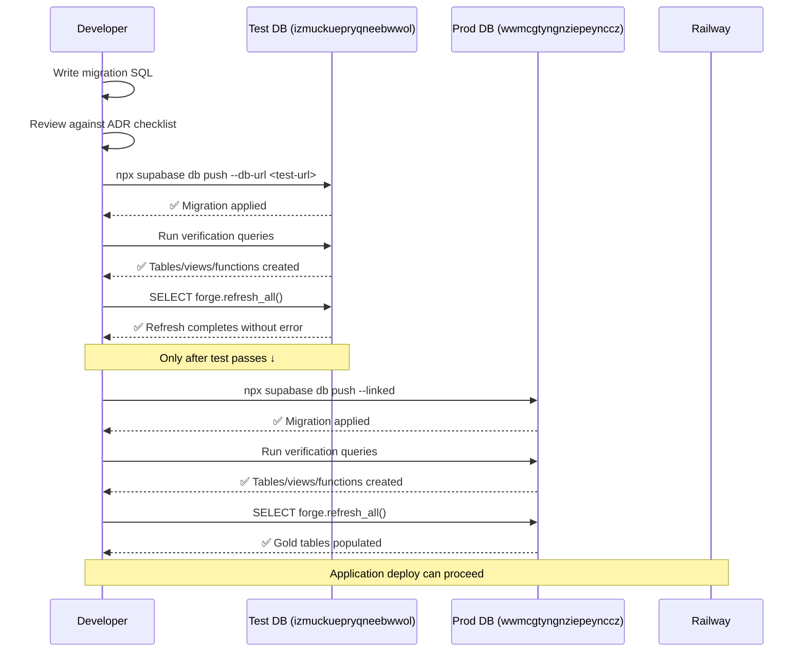

**Step-by-step:**

1. **Write the migration** — In the `cerebro-migrations` repo. Use `npm run migrate:new <name>` to generate the timestamp.

2. **Test on the test project:**
   ```bash
   npx supabase db push --db-url "postgresql://postgres:<test-pw>@db.izmuckuepryqneebwwol.supabase.co:5432/postgres"
   ```

3. **Verify on test:**
   ```sql
   -- Check tables exist
   SELECT table_schema, table_name
   FROM information_schema.tables
   WHERE table_schema IN ('gold', 'hubspot_silver', 'forge')
   ORDER BY table_schema, table_name;

   -- Check RLS enabled
   SELECT schemaname, tablename, rowsecurity
   FROM pg_tables
   WHERE schemaname = 'gold';

   -- Check functions exist
   SELECT routine_schema, routine_name
   FROM information_schema.routines
   WHERE routine_schema = 'forge';

   -- Test refresh
   SELECT forge.refresh_all();
   ```

4. **Deploy to production:**
   ```bash
   npx supabase db push --linked
   ```

5. **Verify on production** — Run the same verification queries.

6. **Populate gold tables:**
   ```sql
   SELECT forge.refresh_all();
   ```

### 5.4 Data Daemon Migration Deployment Procedure

Per ADR-2026-38, data-daemon only applies **daemon-internal** migrations (daemon.* schema). All medallion DDL (bronze, silver, gold, forge, etc.) is owned by cerebro-migrations. The `migrate.py` guard will block any migration that touches medallion schemas.

1. **Write the migration** — Place in `data-daemon/migrations/` with the next sequential number. **Must only touch daemon.* schema.**
2. **Test locally** — Run against test DB: `DATABASE_URL=<test-url> python -m src.main`
3. **Verify** — Check `daemon.migration_history` for the new entry.
4. **Push to deploy branch** — Merge to `develop`. Railway redeploys, startup runs `src/db/migrate.py`.
5. **Verify in production** — Check `daemon.migration_history` in prod.

### 5.5 Migration Ordering Rules

With all medallion DDL in a single repo (cerebro-migrations), ordering is handled by timestamp-sorted migration files within that repo. A single `npm run migrate` applies them in sequence:

```
1. Bronze schema changes — tables that silver reads from
2. Silver materialized views — views that gold reads from
3. Gold tables — tables with RLS
4. RLS policies — security on gold tables
5. Forge refresh functions — populate gold from silver
6. Master refresh — forge.refresh_all() update
7. Initial population — SELECT forge.refresh_all()
```

**This ordering is now guaranteed** because all steps live in one repo, applied in one command. The cross-repo ordering failures that triggered ADR-2026-38 are structurally impossible.

---

## 6. Application Deployment

### 6.1 Cerebro (Next.js)

**Trigger:** Push to `main` (production) or `develop` (development)

**GitHub Actions pipeline:**
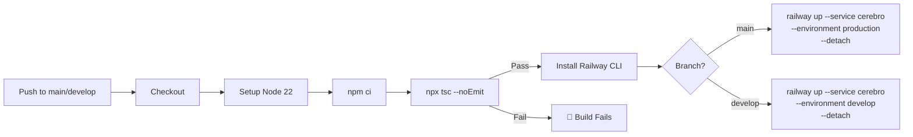

**Docker build (on Railway):**
1. `deps` stage — install npm dependencies
2. `build` stage — run `next build` with build args (Supabase URL, anon key, env label)
3. `final` stage — Alpine with just `server.js` + `.next/static`

**Health check:** Railway pings `/api/health` with 120s timeout and 3 retries.

**Build arguments passed to Docker:**
- `NEXT_PUBLIC_SUPABASE_URL` — Supabase project URL
- `NEXT_PUBLIC_SUPABASE_ANON_KEY` — Public anon key
- `NEXT_PUBLIC_ENV_LABEL` — Environment label (production/develop)

### 6.2 Data Daemon (Python)

**Trigger:** Push to `develop`

**GitHub Actions pipeline:**
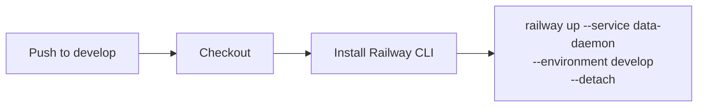

**Startup sequence:**
1. Run all unapplied migrations (`src/db/migrate.py`)
2. Initialize connection pool (ThreadedConnectionPool)
3. Start scheduler loop (60s interval)
4. Start worker threads (default: 3)
5. Start metrics endpoint (`/metrics`)

**Health check:** Railway pings `/health` with 120s timeout and 5 retries.

### 6.3 AI Services (FastAPI)

**Trigger:** Push to `main`

**GitHub Actions pipeline:**
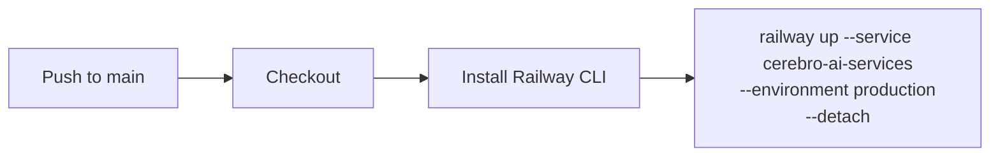

**Key notes:**
- 300s health check timeout (models take time to load)
- Single Uvicorn worker (models are memory-resident)
- Persistent volume at `/data/models` survives redeploys
- If model cache is corrupted, redeploy will re-download

### 6.4 Bot Farm (Python)

**Trigger:** Push to `main` or pull request

This is the most sophisticated pipeline — it includes tests and Slack notifications.

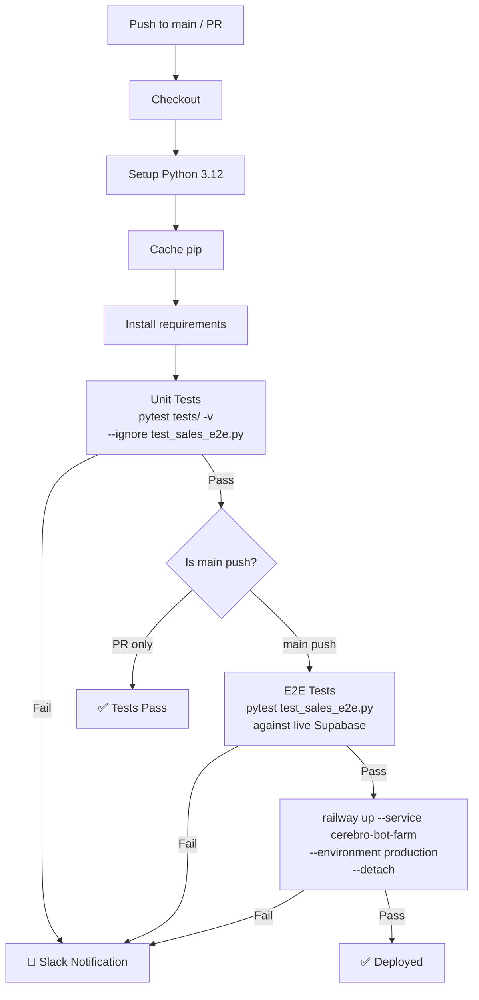

**Slack failure notification:** Posts to channel `C0AD03NG53Q` with:
- Which step failed (tests, E2E, deploy)
- Commit SHA and branch
- Link to the failed Actions run

---

## 7. Post-Deployment Verification

After every deployment, run through this verification matrix. The depth depends on what changed.

### 7.1 Verification Matrix

| Changed | Verify | Command / Query | Expected |
|---------|--------|----------------|----------|
| Application code | Health endpoint | `curl https://<service-url>/health` | 200 OK |
| Cerebro migrations | Migration tracker | `SELECT * FROM supabase_migrations.schema_migrations ORDER BY version DESC LIMIT 5;` | New migration present |
| Daemon migrations | Migration tracker | `SELECT * FROM daemon.migration_history ORDER BY applied_at DESC LIMIT 5;` | New migration present |
| Gold tables | RLS enabled | `SELECT tablename, rowsecurity FROM pg_tables WHERE schemaname = 'gold';` | All `true` |
| Gold tables | Entity isolation | `SET request.jwt.claims = '{"entity_id":"ntx"}'; SELECT * FROM gold.<table> LIMIT 1;` | Only NTX rows |
| Forge functions | Refresh works | `SELECT forge.refresh_all();` | No errors |
| Silver views | Data populated | `SELECT COUNT(*) FROM hubspot_silver.<view>;` | > 0 |
| Gold tables | Data populated | `SELECT COUNT(*) FROM gold.<table>;` | > 0 |
| RLS policies | service_role blocked | `SET ROLE service_role; SELECT * FROM gold.<table>;` | Permission denied |
| AI Services | Model loaded | `curl https://<ai-url>/ready` | 200 OK |

### 7.2 Smoke Test Script

Run this after any deployment that touches the database:

```sql
-- 1. Migration landed
SELECT version, name FROM supabase_migrations.schema_migrations
ORDER BY version DESC LIMIT 3;

-- 2. Gold tables have RLS
SELECT tablename, rowsecurity
FROM pg_tables WHERE schemaname = 'gold' AND rowsecurity = false;
-- Expected: 0 rows (all should have RLS)

-- 3. Forge functions exist and work
SELECT forge.refresh_all();

-- 4. Gold tables populated
SELECT 'pipeline_summary' AS tbl, COUNT(*) FROM gold.pipeline_summary
UNION ALL SELECT 'deal_velocity', COUNT(*) FROM gold.deal_velocity
UNION ALL SELECT 'rep_leaderboard', COUNT(*) FROM gold.rep_leaderboard;
-- Expected: > 0 for each

-- 5. Entity isolation working
SET request.jwt.claims = '{"entity_id":"ntx"}';
SELECT DISTINCT entity_id FROM gold.pipeline_summary;
-- Expected: only 'ntx'
RESET request.jwt.claims;
```

---

## 8. Rollback Procedures

Not all rollbacks are equal. The correct procedure depends on what was deployed and what went wrong.

### 8.1 Rollback Decision Tree

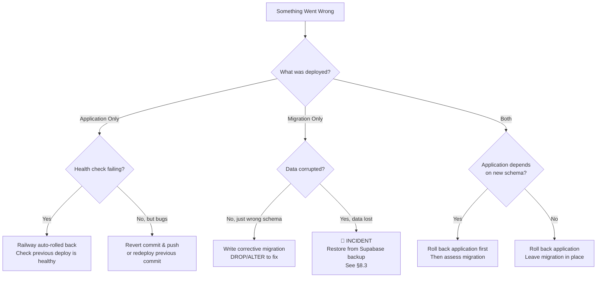

### 8.2 Application Rollback

**Railway automatic rollback:** If the health check fails after deploy, Railway automatically reverts to the previous deployment. No action needed.

**Manual rollback (bugs in production):**

1. **Option A — Revert commit:**
   ```bash
   git revert <bad-commit-sha>
   git push origin main   # Triggers redeploy
   ```

2. **Option B — Redeploy previous commit:**
   ```bash
   railway up --service <service> --environment production --detach
   # Railway CLI deploys current directory state
   ```

3. **Option C — Railway dashboard:**
   - Navigate to the service in Railway dashboard
   - Click the previous successful deployment
   - Click "Redeploy"

### 8.3 Migration Rollback

**Migrations cannot be automatically rolled back.** There is no `DOWN` migration system. Instead:

1. **Write a corrective migration** that undoes the damage:
   ```sql
   -- If you added a bad column:
   ALTER TABLE gold.some_table DROP COLUMN IF EXISTS bad_column;

   -- If you created a bad table:
   DROP TABLE IF EXISTS gold.bad_table;

   -- If you dropped something you shouldn't have:
   -- You need to recreate it from the original migration
   ```

2. **Test the corrective migration on the test DB first.**

3. **Apply to production.**

**If data is corrupted or lost:**
1. **Declare an incident.** Notify the team immediately.
2. **Supabase daily backups** — Supabase Pro retains 7 days of daily backups. Go to Dashboard → Backups → Download the backup from before the incident.
3. **Point-in-time recovery** — Available on Supabase Pro. Restore to a specific timestamp.
4. **Document in a post-mortem** (see §10).

### 8.4 Forge Function Rollback

If a refresh function is producing wrong data:

1. **Stop the bleeding** — Disable the cron or remove the function call from `forge.refresh_all()`.
2. **Fix the function** — Write a corrective migration with the fixed `CREATE OR REPLACE FUNCTION`.
3. **Re-run the refresh** — `SELECT forge.refresh_<table>();` to repopulate from silver.
4. **Verify** — Check row counts and spot-check data.

---

## 9. Environment Management

### 9.1 Environment Matrix

| Environment | Purpose | Database | Railway | Branch |
|-------------|---------|----------|---------|--------|
| **Production** | Live users | `wwmcgtyngnziepeynccz` | production | `main` |
| **Development** | Pre-production testing | `wwmcgtyngnziepeynccz` (same DB!) | develop | `develop` |
| **Test** | Migration testing only | `izmuckuepryqneebwwol` | — | — |

**Critical note:** Development and production share the same database. The Railway `develop` environment is for application testing (different Railway URL), but database changes affect production immediately. This is why migrations MUST be tested on the test project first.

### 9.2 Secret Management

| Secret Type | Stored In | Accessed Via |
|-------------|-----------|-------------|
| API keys (HubSpot, Sage, etc.) | `vault.secrets` table (encrypted) | `secure.get_secret()` in SQL |
| Railway tokens | GitHub Secrets | GitHub Actions `${{ secrets.RAILWAY_TOKEN }}` |
| Supabase credentials | GitHub Secrets / Knox | CI/CD and local dev |
| Slack bot token | GitHub Secrets | Bot Farm failure alerts |

**Rules:**
- Never commit secrets to code. Use environment variables or vault.
- Rotate API keys quarterly.
- Railway tokens are per-environment — production and develop use different tokens.
- Vault secrets are audited — every access is logged.

### 9.3 Connection Strings

| Target | Format |
|--------|--------|
| Supabase Direct (prod) | `postgresql://postgres.<ref>:<pw>@db.wwmcgtyngnziepeynccz.supabase.co:5432/postgres` |
| Supabase Pooler (prod) | `postgresql://postgres.<ref>:<pw>@aws-0-us-east-1.pooler.supabase.com:6543/postgres` |
| Supabase Direct (test) | `postgresql://postgres:<pw>@db.izmuckuepryqneebwwol.supabase.co:5432/postgres` |

**Note:** Test project uses direct connection (port 5432) — pooler may not work for free-tier projects. Production should use the Supavisor session-mode pooler (port 6543) for migrations per ADR-2026-03.

---

## 10. Emergency Hotfix Process

When production is broken and users are affected, use this expedited process.

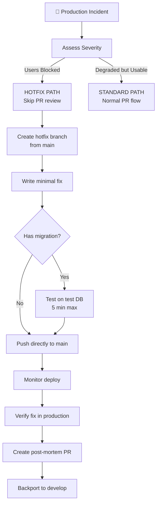

**Hotfix rules:**
1. **Minimal change only.** Fix the bug. Nothing else.
2. **Skip PR review** only if users are blocked. Degraded-but-usable gets normal flow.
3. **Still test migrations** even in emergencies. A bad migration makes it worse.
4. **Post-mortem within 24 hours.** What broke, why, how to prevent it.
5. **Backport to develop** so the branches don't diverge.

---

## 11. Release Cadence

### 11.1 Current Model

Greenmark uses **continuous deployment** — every merge to the deploy branch triggers a production deploy. There are no scheduled release windows or version numbers.

### 11.2 Recommended Practices

| Practice | Status | Notes |
|----------|--------|-------|
| Feature branches | ✅ Active | All work on feature branches |
| PR reviews | ✅ Active | Required before merge |
| Automated type checking | ✅ Active | Cerebro: `tsc --noEmit` |
| Automated unit tests | ✅ Active | Bot Farm |
| Automated E2E tests | ✅ Active | Bot Farm (live Supabase) |
| Automated migration testing | ⏳ Planned | GitHub Action → test DB on PR |
| Deployment notifications | ⚠️ Partial | Bot Farm only (Slack) |
| Git tags for releases | ❌ Not active | Consider for major releases |
| Changelog generation | ❌ Not active | Consider `git log --oneline` per release |

### 11.3 Planned: Automated Migration Gate

A GitHub Action that runs on every PR containing migration files:

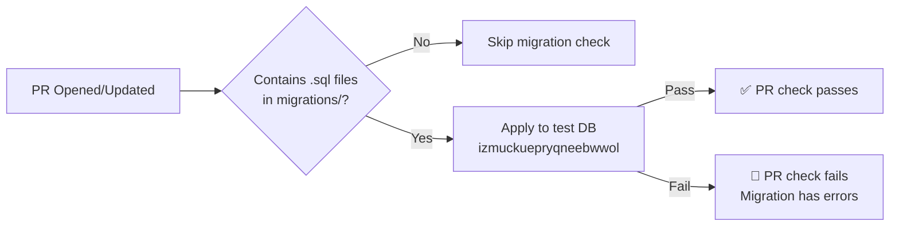

This automates step 2 of §5.3 and prevents broken migrations from reaching production.

---

## 12. AI Agent Deployment Rules

When an AI agent (Claude Code, taskr-worker, etc.) is deploying changes:

### 12.1 Must-Follow Rules

1. **Never push to main/develop without human approval.** AI prepares the PR; humans merge.
2. **Always run pre-flight checklist** (§4) before creating a PR.
3. **Always test migrations on test DB** before including in a PR.
4. **Never modify GitHub Actions workflows** without human review.
5. **Never modify Railway configuration** without human review.
6. **Never rotate or modify secrets** without human approval.
7. **Run governance check** (`check-governance` skillflow) before shipping.

### 12.2 AI-Safe Operations

| Operation | AI Can Do Alone | Needs Human |
|-----------|----------------|-------------|
| Write migration SQL | ✅ | |
| Test migration on test DB | ✅ | |
| Create PR | ✅ | |
| Run type checks / tests | ✅ | |
| Merge PR | | ✅ |
| Push to deploy branch | | ✅ |
| Modify CI/CD pipelines | | ✅ |
| Change secrets / env vars | | ✅ |
| Database backups / restores | | ✅ |
| Emergency hotfixes | | ✅ |

### 12.3 Escalation to Human

AI agents MUST escalate to a human when:
- Any RLS policy change
- Any GRANT/REVOKE statement
- Any SECURITY DEFINER function
- Any change that affects authentication or authorization
- Any Railway configuration change
- Deployment failure after 2 retry attempts
- Conflicting ADR guidance

---

## 13. Monitoring and Observability

### 13.1 Health Check Endpoints

| Service | URL Pattern | Interval | Timeout |
|---------|------------|----------|---------|
| Cerebro | `https://<cerebro-url>/api/health` | Railway default | 120s |
| Data Daemon | `https://<daemon-url>/health` | Railway default | 120s |
| AI Services | `https://<ai-url>/ready` | Railway default | 300s |
| Portal | `https://<portal-url>/health` | Railway default | 120s |

### 13.2 Data Daemon Metrics

The data daemon exposes a Prometheus-compatible `/metrics` endpoint:
- Job queue depth
- Job success/failure rates
- Sync duration per vendor
- Connection pool utilization

### 13.3 What to Monitor After Deploy

| Signal | Where to Check | Red Flag |
|--------|---------------|----------|
| Health check status | Railway dashboard | Any unhealthy service |
| Error logs | Railway logs | Spike in errors post-deploy |
| Migration status | `daemon.migration_history` / `supabase_migrations.schema_migrations` | Missing expected migration |
| Gold table row counts | `SELECT COUNT(*) FROM gold.<table>` | Sudden drop to 0 |
| RLS working | Entity isolation query (§7.2) | Cross-entity data leakage |
| API response times | Railway metrics | >2x increase |

---

## 14. Post-Mortem Template

When an incident occurs (data loss, extended downtime, security breach), document it within 24 hours.

### Post-Mortem Structure

```
# Incident: [Short Title]
**Date:** YYYY-MM-DD
**Duration:** HH:MM
**Severity:** P1 (users blocked) / P2 (degraded) / P3 (internal only)
**Services Affected:** [list]

## Timeline
- HH:MM — What happened
- HH:MM — When detected
- HH:MM — Actions taken
- HH:MM — Resolution

## Root Cause
What specifically broke and why.

## Impact
- Users affected: [count or scope]
- Data affected: [what, if any]
- Duration: [how long]

## Resolution
What fixed it.

## Prevention
1. What will we change to prevent this?
2. [Specific action items with owners]

## Lessons Learned
What did we learn that applies broadly?
```

---

## Why This Exists

Greenmark's infrastructure grew organically — five services, two migration systems, one shared database, and AI agents writing code. Without a documented release process, each deployment was an oral tradition passed between sessions. This SOP codifies the deployment pipeline so that any developer, AI agent, or on-call responder can deploy safely and roll back confidently.

The catalyst: a gold layer expansion requiring coordinated migrations across two systems (data-daemon bronze + cerebro silver/gold), where cross-repo ordering failures led to production incidents. This was resolved structurally by ADR-2026-38 (dedicated cerebro-migrations repo as single migration authority), eliminating the cross-repo coordination problem entirely.

---

## Exceptions

1. **Portal** — Currently has no CI/CD pipeline. Deployed manually or not at all. When it gets a pipeline, update this SOP.
2. **One-off SQL fixes** — Can be applied directly via Supabase SQL Editor for emergency production fixes, but MUST be followed by a migration file committed to the repo to keep migration history accurate.
3. **Supabase dashboard changes** — Auth config, storage policies, and edge functions managed through the Supabase dashboard are not covered by this SOP.

---

## References

| Document | Location |
|----------|----------|
| SOP-002: Database Migrations | `greenmark-docs/sops/SOP-002-database-migrations.md` |
| SOP-004: Technical Debt Remediation | `greenmark-docs/sops/SOP-004-technical-debt-remediation.md` |
| ADR-2026-03: Supabase Connection Strategy | `greenmark-docs/adrs/ADR-2026-03.md` |
| ADR-2026-04: Gold Tables Not Views | `greenmark-docs/adrs/ADR-2026-04.md` |
| ADR-2026-09: service_role Revoked from Gold | `greenmark-docs/adrs/ADR-2026-09.md` |
| ADR-2026-10: SECURITY DEFINER Refresh | `greenmark-docs/adrs/ADR-2026-10.md` |
| ADR-2026-11: Default Deny RLS | `greenmark-docs/adrs/ADR-2026-11.md` |
| ADR-2026-37: Migration Validation via pg_depend | `greenmark-docs/adrs/ADR-2026-37-dag-aware-deploy-planning.md` |
| ADR-2026-38: Unified Migration Authority | `greenmark-docs/adrs/ADR-2026-38-unified-migration-authority.md` |
| Data Daemon CLAUDE.md | `data-daemon/CLAUDE.md` |
| cerebro-migrations CLAUDE.md | `cerebro-migrations/CLAUDE.md` |
| Cerebro CLAUDE.md | `cerebro/CLAUDE.md` |
| Vault Secret Management Runbook | `infra/runbooks/vault-secret-management.md` |
